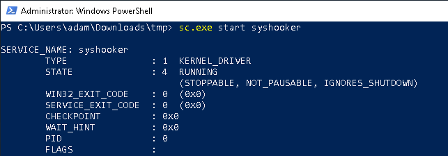

# Syshooker
Kernel driver that allows system call hooking using [InfinityHook](https://github.com/everdox/InfinityHook). Developed as an anti-anti-debug solution for dynamic malware analysis.

**Use at your own risk.**


## Getting started
### Compile
To compile the solution, the following components were used:
- Microsoft Visual Studio Community 2022 (64-bit), version 17.11.4
- Windows SDK (10.0.26100)
- Windows Driver Kit (10.0.26100)
- Windows Driver Kit extension for Visual Studio

Windows SDK and Windows Driver Kit have to have the same version. Newer than the one that we have used should probably be okay. The latest version can be downloaded here: https://learn.microsoft.com/en-us/windows-hardware/drivers/download-the-wdk.
### Loading the driver

> [!WARNING]
> We do not recommend installing and loading the driver on your host machine. It is advised to use a virtual machine instead.

#### Suitable Windows 10 build
The InfinityHook exploit should work up to build 1909 of Windows 10. The solution **has been developed and tested on Windows 10 version 1809, build
17763.1.**

The ISO image for the version that we have used was downloaded from https://os.click/en.
#### Test signing mode
For security reasons, Windows won't let you load unsigned kernel driver unless you enable testsigning mode (run as an administrator):

```sh
bcdedit /set testsigning on
```

After running this command, rebooting is necessary.
#### Creating the service
Copy the compiled driver (`.sys`) to the VM.

Create the driver service:
```sh
sc create syshooker type= kernel binPath= "c:\path\to\your\driver.sys"
```
- *note the spaces after the equal sign*

#### Loading (running) the driver
(run as administrator)

```sh
sc start syshooker

# or in powershell
sc.exe start syshooker
```

If all went well, the output should look like this:



#### Stopping the driver
(run as administrator)
```sh
sc stop syshooker

# powershell
sc.exe stop syshooker
```
